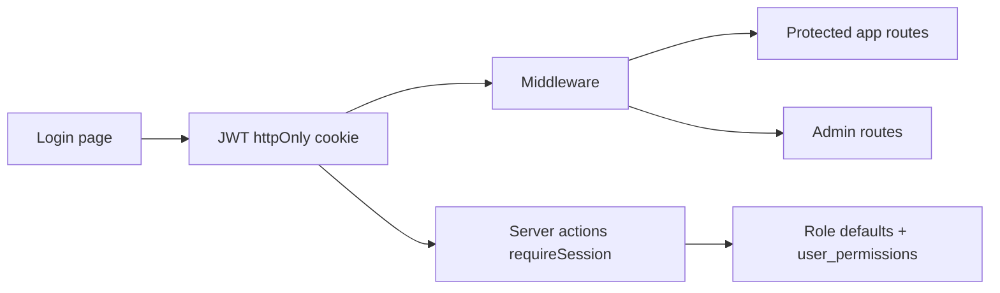

# Authentication & Role-Based Access Control

> **Trạng thái:** Chưa implement — plan cho phiên tiếp theo  
> **Cập nhật:** 2026-06-25  
> **Quyết định:** Role có quyền mặc định + Admin gán thêm/bớt từng chức năng (`user_permissions`)

## Hiện trạng

- [`components/RoleProvider.tsx`](components/RoleProvider.tsx): role **mock** (dropdown Topbar), không session thật.
- [`components/Topbar.tsx`](components/Topbar.tsx): cho phép đổi role tùy ý — sẽ thay bằng user thật + logout.
- Server actions (vd. [`lib/equipment-auth.ts`](lib/equipment-auth.ts)): đọc `role` từ **FormData client gửi** — không an toàn, cần chuyển sang session server.
- **Không có** `middleware.ts`, không có trang login.
- [`model Staff`](prisma/schema.prisma): nhân sự nhật ký sử dụng — **tách biệt** với tài khoản đăng nhập `User`.



---

## Implementation todos

| ID | Task | Trạng thái |
|----|------|------------|
| deps-schema | bcryptjs/jose; Prisma User/Permission/UserPermission/Task + migration + seed admin | pending |
| auth-core | lib/auth: password, session JWT cookie, roles, permissions, guards | pending |
| auth-actions-middleware | login/logout; middleware.ts; login + access-denied pages | pending |
| session-provider | SessionProvider thay RoleProvider; Topbar logout; Sidebar lọc permission | pending |
| admin-ui | Admin: users CRUD, permissions assignment, tasks assignment | pending |
| migrate-actions | Server actions: FormData role → requireSession guards | pending |
| verify | tsc + build + manual QA login/RBAC/tasks | pending |

---

## 1. Dependencies & env

Thêm vào [`package.json`](package.json):

- `bcryptjs` + `@types/bcryptjs` — hash password
- `jose` — ký/verify JWT session

Thêm vào `.env` (document trong HANDOFF, không commit secret):

```
SESSION_SECRET=<random-32+-chars>
SESSION_MAX_AGE=604800
```

---

## 2. Database (Prisma)

Migration mới `prisma/migrations/YYYYMMDD_auth_rbac/migration.sql` + cập nhật [`prisma/schema.prisma`](prisma/schema.prisma):

### Enums

```prisma
enum UserRole { Admin LabManager Analyst QAQC Viewer }
enum UserStatus { Active Disabled }
enum TaskStatus { Pending InProgress Completed NeedsRevision Cancelled }
```

(`LabManager` / `QAQC` map label UI: "Lab Manager", "QA/QC")

### Models

| Model | Bảng | Ghi chú |
|-------|------|---------|
| `User` | `users` | id, name, email @unique, passwordHash, role, status, timestamps |
| `Permission` | `permissions` | id, key @unique, name, description |
| `UserPermission` | `user_permissions` | userId + permissionId @unique |
| `Task` | `tasks` | title, description, assignedToId, assignedById, status, dueDate |

### Seed ([`prisma/seed.ts`](prisma/seed.ts))

**Permissions:**

| key | name |
|-----|------|
| `dashboard` | Dashboard |
| `user_management` | User Management |
| `sample_management` | Sample Management |
| `analysis_results` | Analysis Results |
| `qa_qc_review` | QA/QC Review |
| `reports` | Reports |
| `settings` | Settings |
| `inventory` | Inventory (vật tư) |
| `equipment` | Equipment (module TB) |

**Admin mặc định:**

- Email: `smartai0101@gmail.com`
- Password: `Admin@123456` (hash bcrypt trong seed)
- Role: Admin, Status: Active

Thêm 2–3 user mẫu (Lab Manager, Analyst, Viewer) password `Demo@123456` để QA nhanh.

---

## 3. Auth core (`lib/auth/`)

| File | Trách nhiệm |
|------|-------------|
| `lib/auth/password.ts` | `hashPassword`, `verifyPassword` (bcrypt, cost 12) |
| `lib/auth/session.ts` | JWT cookie `lims_session` (httpOnly, sameSite=lax) |
| `lib/auth/roles.ts` | Map UserRole ↔ label; `roleCapabilities()` giữ logic RoleProvider |
| `lib/auth/permissions.ts` | Role defaults + user_permissions override |
| `lib/auth/guards.ts` | `requireAuth`, `requireRole`, `requirePermission`, `requireAdmin` |

### Role defaults (baseline)

| Permission | Admin | Lab Manager | Analyst | QA/QC | Viewer |
|------------|-------|-------------|---------|-------|--------|
| dashboard | ✓ | ✓ | ✓ | ✓ | ✓ |
| inventory | ✓ | ✓ | ✓ | ✓ | read |
| equipment | ✓ | ✓ | ✓ | ✓ | read |
| sample_management | ✓ | ✓ | ✓ | — | — |
| analysis_results | ✓ | ✓ | ✓ | ✓ | — |
| qa_qc_review | ✓ | ✓ | — | ✓ | — |
| reports | ✓ | ✓ | ✓ | ✓ | ✓ |
| user_management | ✓ | — | — | — | — |
| settings | ✓ | — | — | — | — |

**Admin** bypass mọi check. `user_permissions` = extra grants Admin tick thêm.

---

## 4. Server actions

| File | Actions |
|------|---------|
| `lib/actions/auth.ts` | `login`, `logout` |
| `lib/actions/admin-users.ts` | CRUD user, disable/enable (Admin only) |
| `lib/actions/admin-permissions.ts` | `saveUserPermissions` |
| `lib/actions/tasks.ts` | LM assign; Analyst submit; QA review |

---

## 5. Routes & UI

| Route | Mô tả |
|-------|-------|
| `/login` | Public — email/password |
| `/access-denied` | Thiếu quyền |
| `/admin/users` | User Management (Admin) |
| `/admin/permissions` | Function Assignment |
| `/admin/tasks` | Task Assignment |

**Middleware** [`middleware.ts`](middleware.ts): chưa login → `/login`; map path → permission key.

**Frontend:** `SessionProvider` thay `RoleProvider`; Sidebar lọc theo permission; Topbar logout (bỏ dropdown đổi role).

---

## 6. Migrate server actions

```ts
// Before
const auth = requireEditRole(formData);

// After
const auth = await requireSessionCanEdit();
```

Bỏ `fd.set("role", role)` trên toàn bộ client components.

---

## 7. Kiểm tra sau implement

```powershell
npx prisma db execute --file prisma/migrations/YYYYMMDD_auth_rbac/migration.sql --schema prisma/schema.prisma
npx prisma generate
npx tsx prisma/seed.ts
npx tsc --noEmit
npm run build
```

Manual QA: login admin seed · Viewer không Sửa · Analyst không vào `/admin/users` · revoke `inventory` → Sidebar ẩn · LM giao task · logout.

---

## Phạm vi không làm (phase 1)

- Google OAuth
- Gộp `Staff` với `User` (giữ tách biệt)
